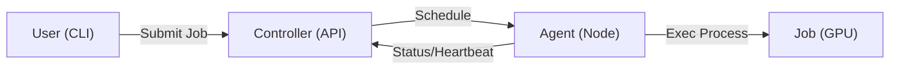

# Angarium

[](https://opensource.org/licenses/Apache-2.0)
[](#)
[](#)

**A lightweight GPU job queue for small clusters (5–100 GPUs) that replaces SSH chaos.**

If your team coordinates GPU usage via a shared spreadsheet or "social contracts," you've outgrown SSH but aren't ready for the "Ops Tax" of Slurm or Kubernetes. **Angarium is built for you.**


---

## 🚀 Quick Start (Under 5 Mins)

### 1. Install
Install the Angarium Agent or Controller on any Linux machine with NVIDIA drivers:

```bash
# Install the Controller (on your head node)
curl -sL https://raw.githubusercontent.com/angariumd/angarium/main/install.sh | sudo bash -s -- controller

# Install the Agent (on every GPU node)
curl -sL https://raw.githubusercontent.com/angariumd/angarium/main/install.sh | sudo bash -s -- agent
```

### 2. Connect
```bash
angarium login
# Follow the prompts to set your URL and token
```

---

## Why Angarium?

| Feature           | The "Spreadsheet"  | **Angarium**        | Slurm / Kubernetes |
| :---------------- | :----------------- | :------------------ | :----------------- |
| **Setup Time**    | 0 mins             | **< 5 mins**        | Days / Weeks       |
| **GPU Awareness** | Gut feeling        | **Automatic**       | Automatic          |
| **Isolation**     | Social contract    | **Process-level**   | Container (Slow)   |
| **Ops Overhead**  | High (Human error) | **Near-Zero**       | "Need an Ops Team" |
| **Vibe**          | Periodic Anxiety   | **"It just works"** | "Open a ticket"    |

### The "Zero Overhead" Philosophy
*   **No Containers required**: We launch standard Linux processes. No Dockerfiles, no image pulls, zero overhead. If it runs in your shell, it runs in Angarium.
*   **Shared Drive First**: Most labs already have NFS or a shared drive. We don't move your files; we just move where the command runs.
*   **GPU-First**: Aware of GPU health and memory via `nvidia-smi`. No "zombie" processes eating your VRAM.

See [Why Angarium?](docs/comparison.md) for a deeper dive.

---

## Key Features
- **GPU-First**: Automatic discovery of GPU health, utilization, and memory.
- **Single-Node Placement**: Best-fit packing for optimal cluster utilization.
- **Minimalist**: Standard OS processes, not containers.
- **Visibility**: Clear "why queued" status (e.g., "fragmented" or "insufficient capacity").
- **Streaming Logs**: Real-time log tailing from any node in the cluster.

---

## Architecture



---

## Current Status: Early Alpha

Angarium is currently in **Early Alpha**. We are looking for researchers and AI labs with 5–100 GPUs to try it out and give us feedback.

### Join the Beta
We'd love to hear from you! If you find it useful or if something breaks for your setup, please:
1.  **Open an Issue**: We track everything on GitHub.
2.  **Email Us**: [samfrmd[at]gmail.com]
3.  **Contribute**: See [CONTRIBUTING.md](CONTRIBUTING.md).

---

## License
Apache License 2.0. See [LICENSE](LICENSE) for details.
