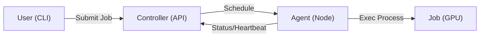

# Angarium

A lightweight GPU job queue for small clusters (5–100 GPUs) that replaces SSH chaos.

## Architecture



## Quick Start

### Installation

Install the Angarium Agent or Controller on any Linux machine:

```bash
curl -sL https://raw.githubusercontent.com/angariumd/angarium/main/install.sh | sudo bash -s -- agent

# for controller

curl -sL https://raw.githubusercontent.com/angariumd/angarium/main/install.sh | sudo bash -s -- controller
```

### Build from source

```bash
git clone https://github.com/angariumd/angarium.git
cd angarium
make build
sudo ./install.sh
```

## Comparison: Zero Overhead

| Feature | The "Mental" Sheet | Angarium | Slurm / Kubernetes |
| :--- | :--- | :--- | :--- |
| **Setup Time** | 0 mins | **< 5 mins** | Days / Weeks |
| **GPU Awareness** | Manual / Gut feeling | **Automatic** | Automatic |
| **Isolation** | Social contract | **Process-level** | Container (Slow) |
| **Ops Overhead** | High (Human error) | **Near-Zero** | "Need an Ops Team" |
| **The Vibe** | Periodic Anxiety | **"It just works"** | "Open a ticket" |

See [Why Angarium?](docs/comparison.md) for a deeper dive.

## Configuration

Check the [Configuration Guide](docs/configuration.md) for simple examples of how to tune your cluster.

## Mission
Provide a minimal GPU-first scheduler without the overhead of Kubernetes, containers, or Slurm. Guarantee no double-booking, safe execution, and reliable cleanup.

## NON-GOALS (MVP)

The following features are explicitly out of scope for the initial MVP to keep complexity low:

- **No containers/Kubernetes**: Jobs are standard OS processes.
- **No preemption**: Once a job is running, it stays until completion or manual cancel.
- **No multi-node training**: Each job must fit on a single node.
- **No advanced scheduling**: No fair-share, quotas, backfilling, or NVLink awareness.
- **No code upload**: No bundling, rsync, or git-clone logic. Users must ensure code is on a shared FS.
- **No container images**: Jobs run as OS processes directly. No Docker/Podman/Singularity.
- **No plugin system**: Built-in logic only.
- **No generic RBAC**: Simple token-based identity for ownership.
- **No high availability**: Single controller instance (state in SQLite).

## Key Features
- **GPU-First**: Aware of GPU health and memory via `nvidia-smi`.
- **Single-Node Placement**: Best-fit packing for optimal utilization.
- **Minimalist**: OS processes, not containers.
- **Visibility**: Clear "why queued" status for pending jobs.

## Job Execution Model
- **Shared Filesystem**: The scheduler does NOT move user code or files. Jobs must run from a working directory (`cwd`) that is already accessible on GPU nodes (e.g., via NFS, SMB, or Lustre).
- **Execution**: The Agent launches jobs with the specified `cwd`, environment variables, and `CUDA_VISIBLE_DEVICES` set by the scheduler.
- **No Uploads**: The CLI does not bundle or upload code. It only sends the execution context (command and `cwd`) to the Controller.

## Components
- **Controller**: REST API, SQLite state, scheduler loop.
- **Agent**: Heartbeat, GPU inventory, job execution/cleanup.
- **CLI**: Submission, status, and log tracking.

## API Summary
See [docs/api.md](docs/api.md) for details.

## License
Apache License 2.0. See [LICENSE](LICENSE) for details.
