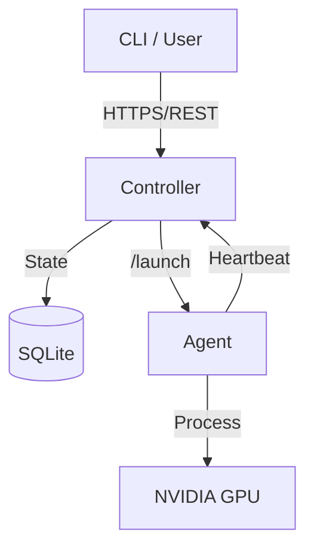
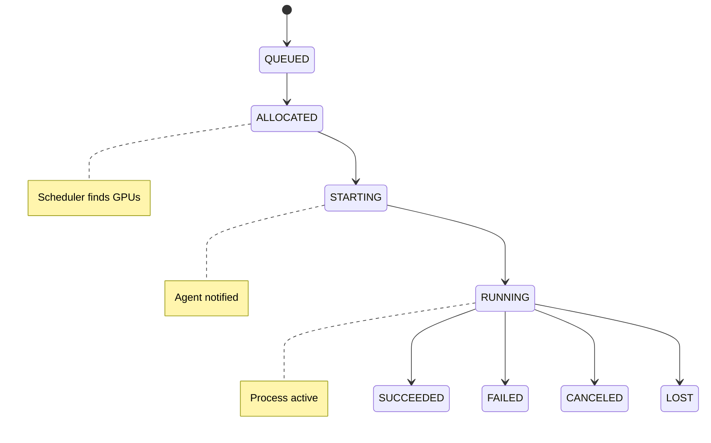

# Architecture Overview

Angarium is built for high-performance GPU clusters where simplicity and low latency are prioritized over container isolation.

## System Overview

## Core Components

### Controller
The centralized state manager and scheduler.
- **REST API**: Serves requests from the CLI and monitors Agent health.
- **Scheduler**: Implements a "best-fit" packing algorithm to maximize GPU utilization on single nodes.
- **Reconciliation**: Periodically polls Agents to detect "zombie" processes (running on Agent but not in DB) or "orphans" (in DB but not on Agent).
- **SQLite Database**: Stores the source of truth for nodes, GPUs, jobs, and allocations.

### Agent
A lightweight daemon running on every GPU node.
- **Inventory Detection**: Uses `nvidia-smi` to report GPU health and memory.
- **Shared Secret Auth**: Communicates with the Controller via a shared token.
- **Process Management**: Launches jobs as direct OS sub-processes using `exec.Command`.
- **Isolation**: Minimal. Uses `CUDA_VISIBLE_DEVICES` to fence GPUs. Does not use Docker/Kubernetes.

## Job Lifecycle

## Scheduling Contract

1. **Wait and Pack**: The scheduler prioritizes fitting large jobs onto a single node to avoid inter-node latency.
2. **Leases**: When a job is allocated, GPUs are "leased" for a short duration. If the Agent fails to move the job to `STARTING` before the lease expires, the GPUs are automatically released.
3. **Pre-Conditions**: The `cwd` specified in a job must be accessible to the Agent node. Angarium expects a shared filesystem (NFS/Lustre).
